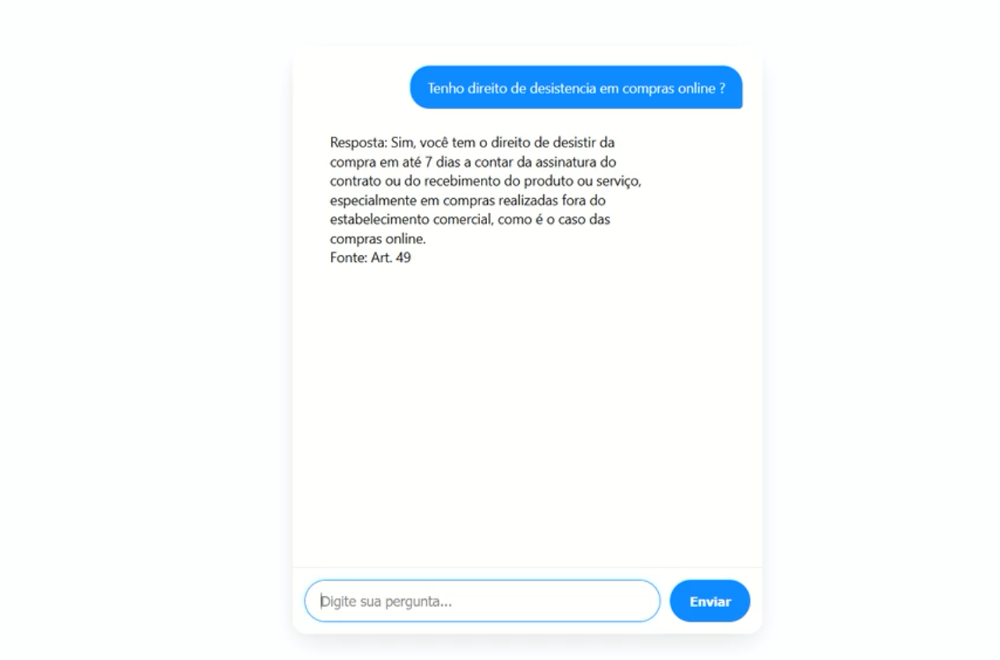

# SAC-CDC - Atendimento automático para o Consumidor

## link de demonstração
https://youtu.be/ePZiamxFapw

## Requisitos
- Python 3.10+
- Ter uma chave OpenAI (`OPENAI_API_KEY`)

## Instalação
1. `python -m venv venv && source venv/bin/activate`
2. `pip install -r requirements.txt`
3. Copiar `.env.example` para `.env` e definir `OPENAI_API_KEY`.

## Executando
flask --app main run

Acesse `http://127.0.0.1:5000/chat`

## Endpoints
- `POST /ask` — body: `{ "question": "..." }` → resposta JSON `{ "answer": "...", "source": "..." }`
- `GET /chat` — interface web